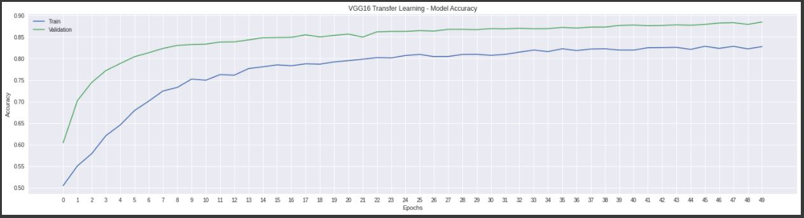
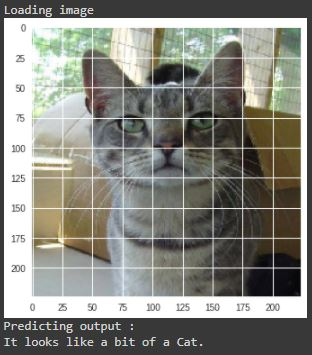
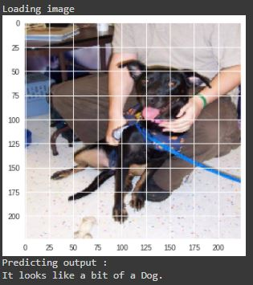

# Cats-vs-Dogs-Classification-using-CNN

 

## Business Objectives :

Image classification is the process of taking an input (like a picture) and outputting a class or a probability that the input is a particular class.

The convolutional neural network (CNN) is a class of deep learning neural networks. CNNs represent a huge breakthrough in image recognition.

The main aim of the project is to distinguish which image contains a dog in it and which one has a cat in it.

## Data Collection :

The data was collected from Kaggle.

Link: https://www.kaggle.com/c/dogs-vs-cats/data

Kaggle had hosted this very popular contest in late 2013 to classify cat & dog images into the appropriate class.

The train.zip archive consists of 25,000 images of different sizes (12,500 of each class!). This is a huge dataset to train our model on. 

However, we have trained the model on a much smaller dataset, consisting of randomly selected images from train set to create — 5,000 training images, 1,000 eval images and 500 test images each of cats and dogs.

## Modelling :

The following modelling approach was used in the project:

1. Load and explore data
2. Load pre-trained VGG16 model
3. Customize and fine-tune the pre-trained model
4. Train the model on image data

The detailed analysis and model creation can be found in the .ipynb file. 

## Result :

The results from Classical ML Models are as below:

Some of the test images are given below.

## Conclusion :

We are able to achieve a training accuracy of 85% and a validation accuracy of 88% using VGG16 transfer learning. 

Our model learned to successfully identify both dogs and cats. Its predictions are very confident in the majority of the cases and they are lower only for anything that’s unusual like pose, fur color etc. It’s definitely expected behavior because our model has trained on less amount of such uncommon data.

We can further improve our accuracy by a significant amount using data augmentation, training epochs and using different architectures to extract even better features.
